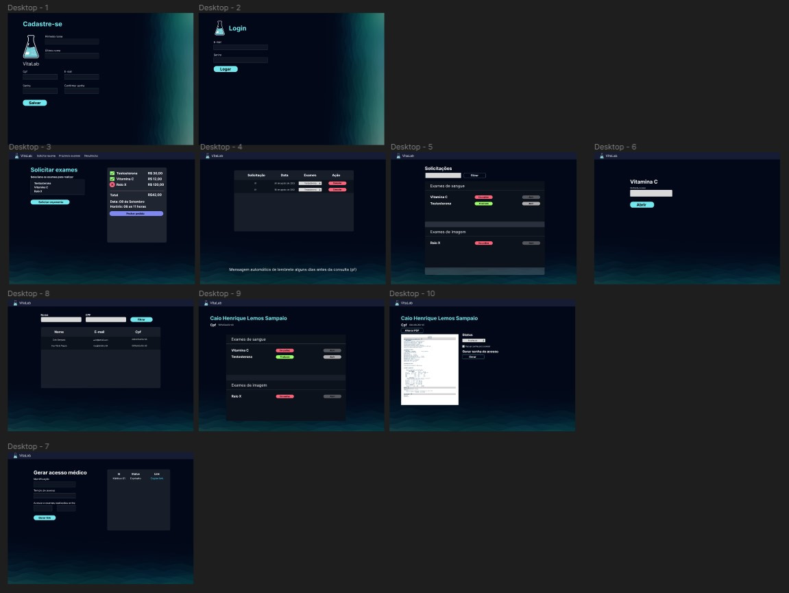

# PYSTACK WEEK 8.0 - Pythonando com Caio Sampaio

## Projeto VitaLab

      

Evento Online e Gratuito da [Pythonando](https://pythonando.com.br/psw/evento/)  
Fazer um projeto do zero com Python e Django
  
AULAS GRAVADAS E AO VIVO  
DE 30/09 A 08 DE OUTUBRO DE 2023.

  <a href="#-tecnologias">Tecnologias</a>&nbsp;&nbsp;&nbsp;|&nbsp;&nbsp;&nbsp;
  <a href="#-projeto">Projeto</a>&nbsp;&nbsp;&nbsp;|&nbsp;&nbsp;&nbsp;
  <a href="#-layout">Layout</a>&nbsp;&nbsp;&nbsp;|&nbsp;&nbsp;&nbsp;
  <a href="#memo-licença">Licença</a>

## 🚀 Tecnologias  

Esse projeto foi desenvolvido com as seguintes tecnologias:  

- Python
- Django
- Bootstrap
- HTML e CSS

## 💻 Projeto  

[Material Complementar no Notion - Aula 1](https://grizzly-amaranthus-f6a.notion.site/PSW-8-0-Aula-1-c5f28c09c09f4493ad20911f984e4fc8)  

## 🔖 Layout

Você pode visualizar o [layout do projeto no Figma](https://www.figma.com/file/FzqXqJXe5a8LWcq7LxISHN/Untitled?type=design&node-id=0-1&mode=design&t=LO7jO7shOtADB4oM-0)  

## :memo: Licença

Esse projeto está sob a licença MIT.

---

Feito com ♥ by Patrícia

